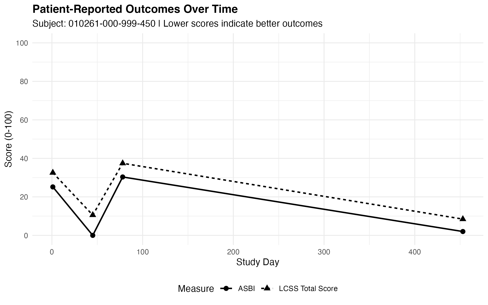

# Oncology Clinical Programming Portfolio

This repository documents my transition into clinical statistical programming through a series of hands-on projects using a publicly available oncology clinical trial submission package.

Using a Phase II oncology study from Sanofi (EFC10261), I am building reproducible clinical programming workflows that reflect the types of programming, data review, quality control, and documentation performed by clinical and statistical programmers.

---

## Study

- **Sponsor:** Sanofi
- **Study:** EFC10261
- **Therapeutic Area:** Non-Small Cell Lung Cancer (NSCLC)
- **Data Standard:** CDISC SDTM

---

## Portfolio Roadmap

| Milestone | Status |
|-----------|--------|
| ✅ Milestone 1 – SDTM Domain Inventory | Complete |
| ✅ Milestone 2 – Subject-Level Clinical Review | Complete |
| ✅  Milestone 3 – Cross-Domain Data Validation | Planned |
| ⏳ Milestone 4 – Analysis-Ready Dataset Exploration | Planned |
| ⏳ Milestone 5 – Clinical Programming Case Study | Planned |

---

## Completed Milestones

### ✅ Milestone 1 – SDTM Domain Inventory

- Classified SDTM domains by CDISC observation class
- Explored study metadata and domain structure
- Identified relationships between clinical domains
- Built a reproducible SDTM inventory workflow in R

### ✅ Milestone 2 – Subject-Level Clinical Review

Followed a single study participant (`010261-000-999-450`) across multiple SDTM domains to reconstruct the subject's clinical course.

This milestone included:

- Subject selection workflow
- Cross-domain clinical timeline
- Adverse event review
- Patient-reported outcome review
- Target lesion assessment
- Reviewer listings
- Publication-quality figures
- Clinical review report

---

### Patient-Reported Outcomes

<p align="center">
  
</p>

---

### Target Lesion Size Changes from Baseline

<p align="center">
  
</p>

---

### Subject-Level Clinical Timeline

<p align="center">
  
</p>

---

## Skills Demonstrated

- R programming
- Clinical trial data exploration
- CDISC SDTM
- Subject-level clinical review
- Cross-domain data integration
- Longitudinal data visualization with **ggplot2**
- Clinical data validation
- Reviewer-friendly outputs
- Reproducible programming workflows
- Git and GitHub version control

---

## Repository Structure

```text
R/                  Clinical programming scripts

data/
├── raw/            Original SDTM datasets
└── derived/        Derived datasets

docs/               Study documentation and metadata

milestones/         Milestone planning and documentation

output/
├── figures/        Clinical figures
├── listings/       Reviewer listings
└── tables/         Summary tables

reports/            Final milestone reports
```

---

## Next Milestone

Milestone 3 will focus on cross-domain SDTM data validation by identifying inconsistencies, missingness, and clinically relevant data quality issues across multiple clinical domains.
