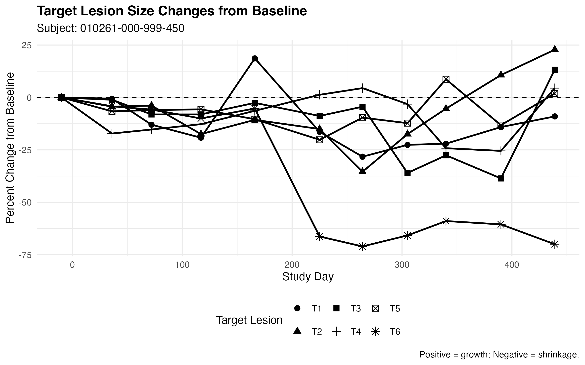
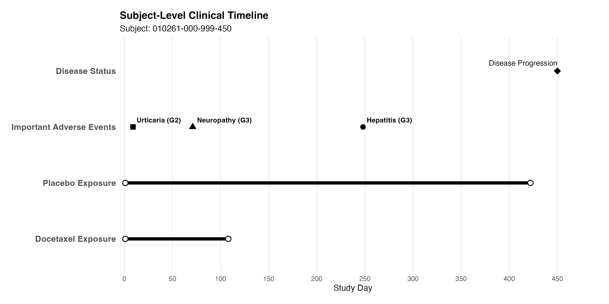

# Milestone 2 — Subject-Level Clinical Review

This milestone demonstrates a subject-level clinical review workflow using CDISC SDTM data from the Sanofi EFC10261 Phase II Non-Small Cell Lung Cancer (NSCLC) study.

The objective was to reconstruct the clinical course of a single study participant by integrating multiple SDTM domains, identifying clinically meaningful events, and producing reviewer-friendly outputs commonly created during clinical data review.

---

## Objective

Select a study participant with rich longitudinal data and review their clinical experience across multiple SDTM domains, including treatment exposure, adverse events, disease progression, and patient-reported outcomes.

---

## Study

- **Sponsor:** Sanofi
- **Study:** EFC10261
- **Therapeutic Area:** Non-Small Cell Lung Cancer (NSCLC)
- **Data Standard:** CDISC SDTM

---

## Subject Selected

**Subject ID:** `010261-000-999-450`

This subject was selected because they contained longitudinal data across all major review domains, including:

- Treatment modifications
- Multiple adverse events
- Disease progression
- Target lesion assessments
- Patient-reported outcomes
- Long-term follow-up

These characteristics provided a realistic example of the type of integrated clinical review performed by statistical programmers and clinical data reviewers.

---

## Workflow

### Script 01 — Subject Selection

- Identified subjects represented across major SDTM domains
- Created subject-level domain counts
- Screened candidate subjects
- Documented rationale for final subject selection

---

### Script 02 — Subject Timeline

Constructed a standardized chronological timeline using:

- Exposure (EX)
- Adverse Events (AE)
- Disposition (DS)

Study days were derived from the Subject Visits (SV) domain when necessary.

---

### Script 03 — Clinical Review

Performed detailed review of the selected subject including:

- Clinically important adverse events
- Peripheral sensory neuropathy follow-up
- Patient-reported outcomes (LCSS and ASBI)
- Target lesion measurements
- Overall disease response

Reviewer listings were generated for each review.

---

### Script 04 — Create Figures

Produced publication-quality reviewer figures illustrating:

- Patient-reported outcomes over time
- Percent change in target lesion size from baseline
- Integrated clinical timeline

---

## Key Findings

### Treatment

- Initial docetaxel dose reduction following early urticaria
- Permanent discontinuation of docetaxel after development of Grade 3 peripheral sensory neuropathy
- Placebo treatment continued following discontinuation of chemotherapy

### Safety

Clinically important adverse events included:

- Grade 2 urticaria
- Grade 3 peripheral sensory neuropathy
- Grade 3 cytolytic hepatitis

### Patient-Reported Outcomes

Patient-reported symptom burden initially improved during treatment, temporarily worsened around treatment modification, and improved again by the end of treatment.

### Disease Response

Target lesion assessments demonstrated mixed lesion behavior over time, with eventual disease progression documented near the end of treatment.

---

## Outputs

### Derived Data

- Subject timeline
- Subject domain counts

### Reviewer Listings

- Important adverse event review
- Patient-reported outcomes
- Lesion change summary
- Disease response review

### Figures

#### Patient-Reported Outcomes

<p align="center">
  
</p>

---

#### Target Lesion Size Changes from Baseline

<p align="center">
  
</p>

---

#### Subject-Level Clinical Timeline

<p align="center">
  
</p>

---

## Folder Structure

```text
milestone2_subject_clinical_review/

├── programs/
│   ├── 00_setup.R
│   ├── 01_subject_selection.R
│   ├── 02_subject_timeline.R
│   ├── 03_clinical_review.R
│   └── 04_create_figures.R
│
├── derived/
│
├── outputs/
│   ├── figures/
│   ├── listings/
│   └── tables/
│
├── report/
│   └── Milestone2_Subject_Clinical_Review.pdf
│
└── README.md
```

---

## Skills Demonstrated

- CDISC SDTM review
- Subject-level clinical data review
- Cross-domain clinical integration
- Longitudinal data visualization with **ggplot2**
- Clinical timeline construction
- Reviewer listing generation
- Reproducible R programming
- Quality control using validation checks
- Git and GitHub version control